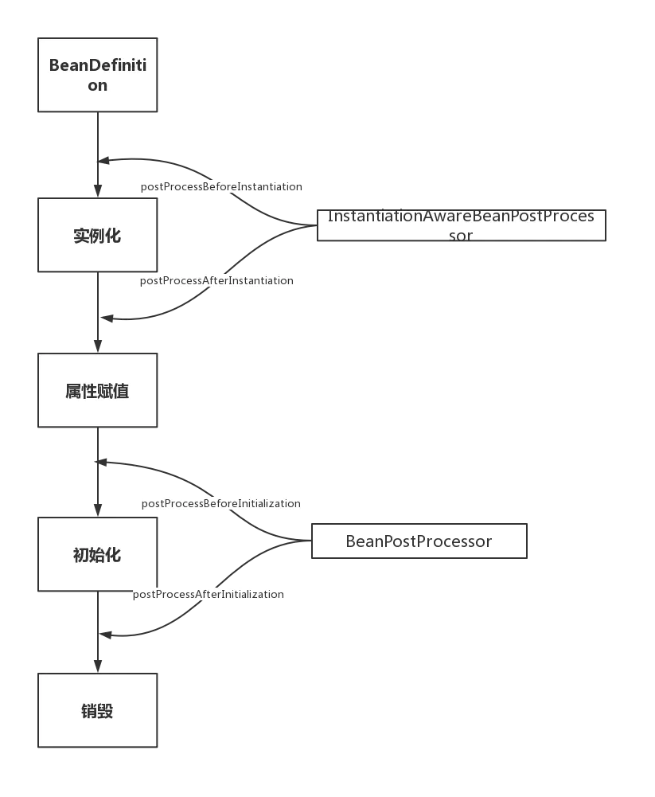

# bean生命周期



```java
@FunctionalInterface
public interface BeanFactoryPostProcessor {
	/**
	 * 容器加载完成bean definition，但未开始实例化，允许这里修改bean definition
	 */
	void postProcessBeanFactory(ConfigurableListableBeanFactory beanFactory) throws BeansException;

}
```

```java
public interface BeanPostProcessor {
    /**
     * bean实例化后，注入后，aware注入后，回调
     */
    @Nullable
    default Object postProcessBeforeInitialization(Object bean, String beanName) throws BeansException {
        return bean;
    }

    @Nullable
    default Object postProcessAfterInitialization(Object bean, String beanName) throws BeansException {
        return bean;
    }
}
```

# 三级缓存

* singletonFactories
* earlySingletonObjects
* singletonObjects

---

# 6个RootBeanDefinition

## ConfigurationClassPostProcessor

处理@Configuration、@Bean、@Import

## AutowiredAnnotationBeanPostProcessor

处理@Autowired、@Value、@Inject、@Lookup

## CommonAnnotationBeanPostProcessor

处理@PostConstruct、@PreDestroy

## InitDestroyAnnotationBeanPostProcessor

处理接口InitializingBean、DisposableBean

## EventListenerMethodProcessor、DefaultEventListenerFactory

处理@EventListener

