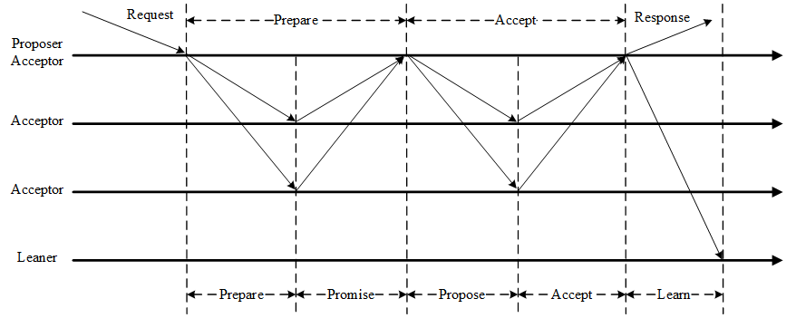

# 服务注册&发现

|名称|eureka|zookeeper|consul|
|---|---|---|---|
|CAP|AP|CP|CP|
|算法| |Paxos|Raft|
|注册方式|客户端心跳；心跳小于阈值85%自我保护|超过半数的节点同步

|自我保护|概念|计算方法|
|---|---|---|
|Renews threshold|上一分钟期望的renew消息数量|2 * n * 0.85 (85%阈值)
|Renews (last min)|上一分钟收到的renew消息数量|2 * n (30s发一个renew，n=实例个数)

* eureka server打开自注册，自己也算一个n

Paxos算法流程

在一个分布式系统中，如何就一个提案达成一致

Prepare阶段：

* Proposer选择一个提案编号n并将prepare请求发送给 Acceptor。
* Acceptor收到prepare消息后，如果提案的编号大于它已经回复的所有prepare消息，则Acceptor将自己上次接受的提案回复给Proposer，并承诺不再回复小于n的提案。

Accept阶段：

* 当一个Proposer收到了多数Acceptor对prepare的回复后，就进入批准阶段。它要向回复prepare请求的Acceptor发送accept请求，包括编号n和根据prepare阶段决定的value（如果根据prepare没有已经接受的value，那么它可以自由决定value）。
* 在不违背自己向其他Proposer的承诺的前提下，Acceptor收到accept请求后即接受这个请求。
